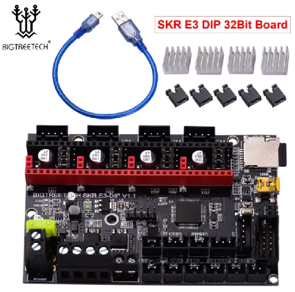
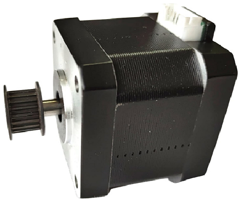
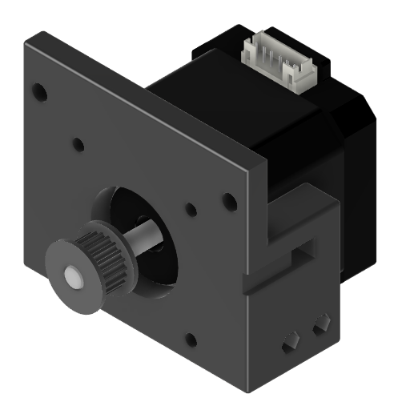
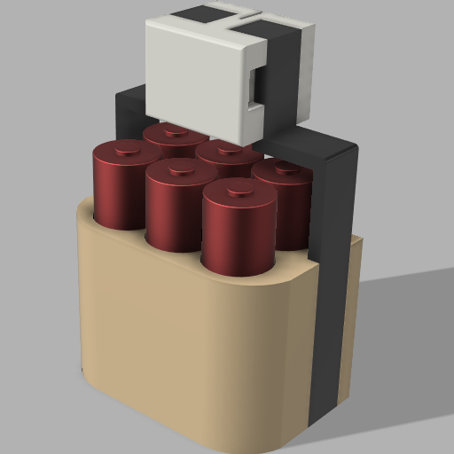
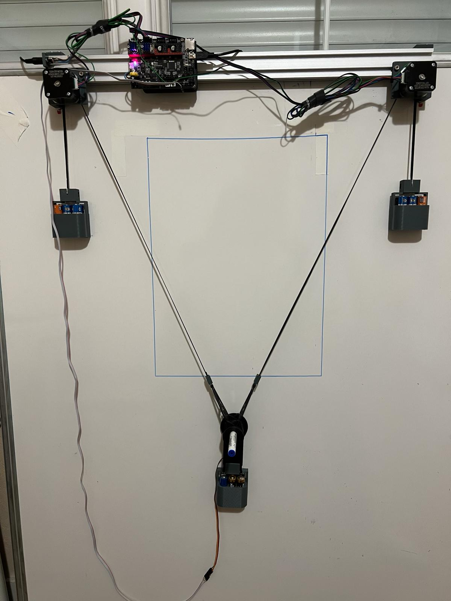
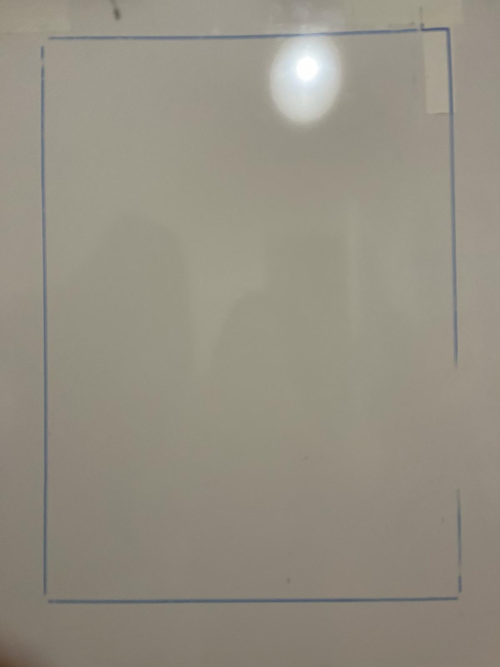
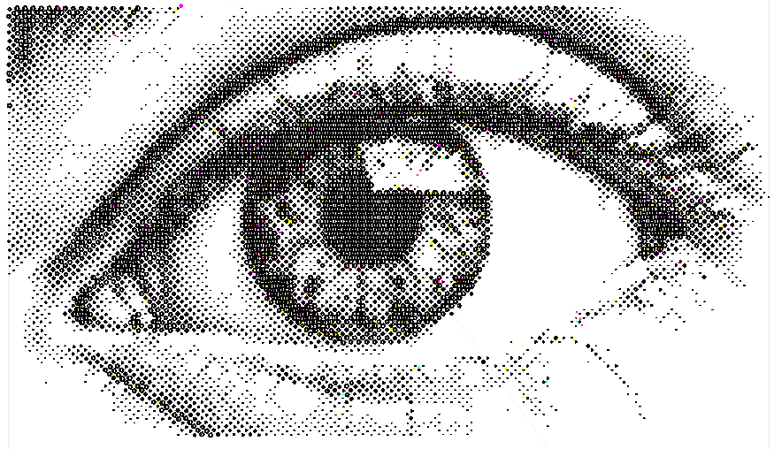
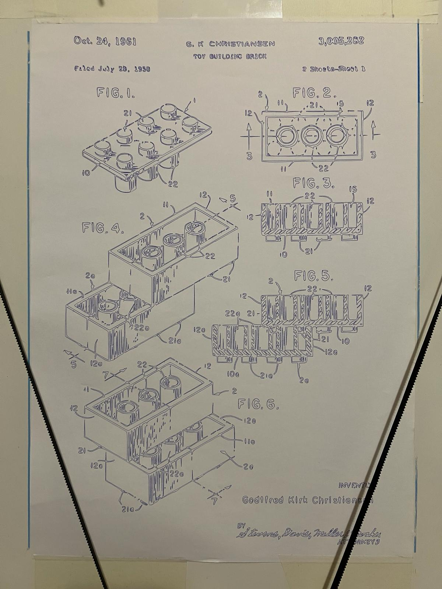
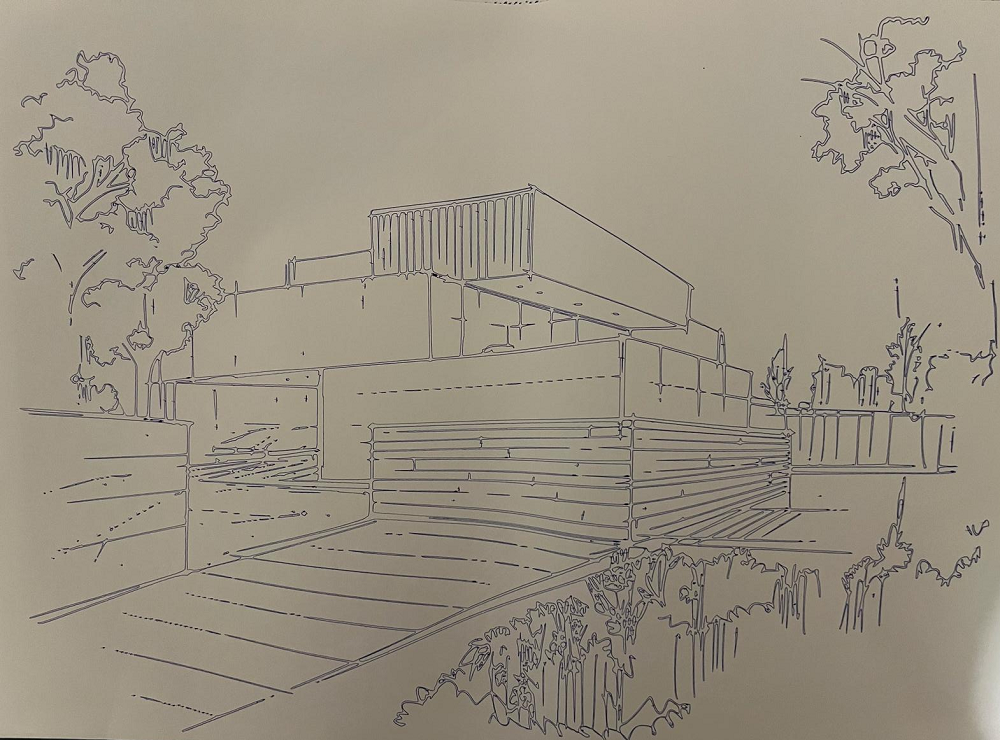
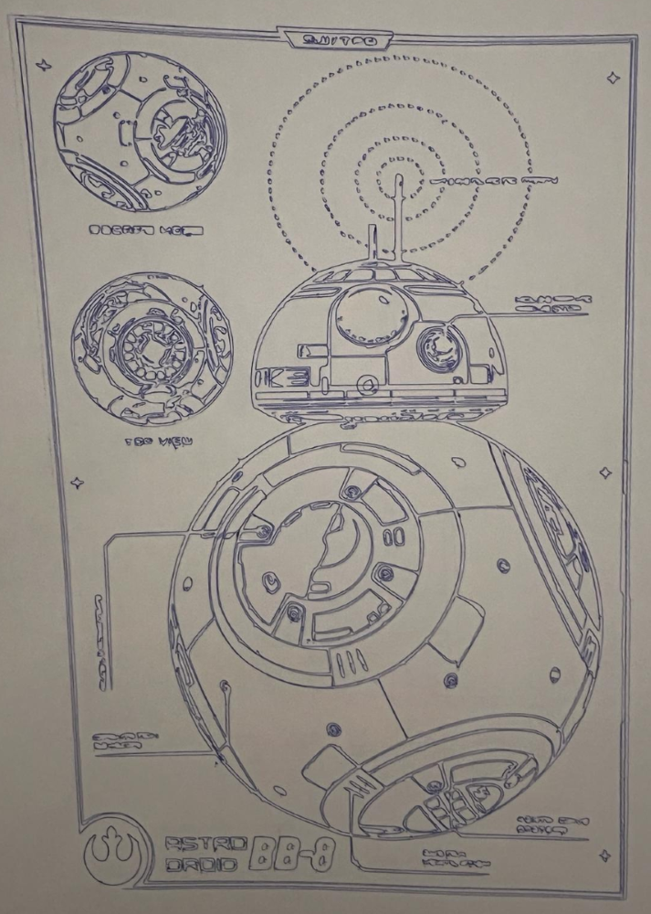

# 1 - Le concept du Polargraph

Un Polargraph (aussi appelé "plotter") est un dispositif mécanique de dessin automatisé utilisant des coordonnées polaires pour déplacer un stylo sur une surface plane. Il combine l'art, la robotique et la technologie, permettant la création de dessins complexes, à l'aide d'un système de coordonnées basé sur des angles et des distances par rapport à un point central. L'origine du Polargraph remonte à des artistes et bricoleurs explorant les possibilités de la robotique pour produire des œuvres d'art uniques. Le premier Polargraph fut le [PolargraphSD](https://www.polargraph.co.uk/) de Sandy Noble.

# 2 - Les débuts du CreativePolargraph

L'idée de faire un polargraph date de février 2023, lorsque j'ai découvert le projet de Sandy Noble. Souhaitant en réaliser un, cela a débuté par une phase de documentation et de recherches. J'ai trouvé un autre polargraph nommé [Makelangelo 5](http://www.makelangelo.com/). Peu après, épaulé par mon père et tous deux passionnés de mécanique et de robotique, j'ai décidé de constuire mon propre polargraph vertical, le CreativePolargraph. Pour cela, j'ai fait avec les moyens du bord, c'est-à-dire en piochant dans les pièces de rechanges de mes imprimantes 3D. J'ai trouvé des moteurs pas à pas, et une carte d'imprimante 3D (une BTT_SKR_E3_DIP).

le makelangelo 5

Voici la carte et les moteurs utilisés :

# 3 - Ça avance !

J'ai décidé d'en faire un vrai projet, je me suis donc investi à 100% dedans. Il s'en est suivi une phase de CAO durant laquelle j'ai dessiné les pièces support des moteurs ainsi que de la carte mère en 3D, puis j'ai pu les imprimer à l'aide d'une de mes imprimantes 3D.

J'ai aussi réalisé les poids, qui sont composés de 6 piles vides chacun, un poids pour chaque extrémité de la courroie et un dernier poids au niveau du stylo.

Voici le résultat final : 

Pour les intéressés, le schéma électronique sera bientôt disponible.

Les modèles 3D des supports sont d'ores et déjà disponibles sur mon github dans le repository du [CreativePolargraph](https://github.com/CreativeTab/CreativePolargraph)

# 4 - Les difficultés

Une fois le hardware fini, il a fallu s'attaquer au software. Utilisant une carte d'imprimante 3D, j'ai du adapter un software nommé Marlin (l'original est le [Marlin](https://github.com/MarginallyClever/Marlin) de MarginallyClever). Marlin est un micrologiciel open source pour commander une imprimante 3D. Le Marlin de MarginallyClever étant déjà fait pour gérer des coordonnées polaires, j'ai réalisé un fork de ce Marlin pour l'adapter à mon besoin. Le Marlin modifié par mes soins est disponible sur mon [github](https://github.com/CreativeTab/MarlinPolargraph/tree/2.1.x-polargraph-better).

Une fois le Marlin adapté et recompilé à la carte électronique, il a fallu commencer les réglages. C'était long et fastidieux comme à chaque fois que l'on changeait un réglage, il fallait reflasher le firmware. Les réglages avaient pour but d'avoir un rectangle parfait au final, pour avoir la meilleure horizontalité et verticalité possible pour avoir des dessins les plus précis possible. Il a pour cela fallu utiliser des formules mathématiques afin de calculer les positions en Y et en X du stylo. J'ai tout d'abord essayé d'être précis en A4, puis j'ai agrandi les courroies et écarté les moteurs pour passer à un format A3 pour m'amuser.
Voici le résultat que j'ai pu obtenir après plusieurs jours de réglages : 

Maintenant, je peux essayer d'imprimer vraiment un dessin ! 

# 5 - Le résultat

Pour que Marlin comprenne mon dessin, il faut le transformer dans un format que l'on appelle gcode (un format standard pour l'impression 3D). J'utilise pour cela le software open source [Makelangelo](https://github.com/MarginallyClever/Makelangelo-software). J'ai ensuite 2 possibilités : soit j'importe un svg, soit j'importe un fichier image (.png, .jpg, ...) et je peux ensuite lui appliquer divers effets comme imprimer le dessin en petits cercles. Voici un exemple avec une image d'un [oeil](https://fr.pngtree.com/freebackground/an-artistic-drawing-of-an-eye-with-black-and-white_2676360.html) :  

Voici le premier dessin que j'ai imprimé après paramétrage : 

et voici différentes impressions : 

# 6 - Améliorations futures

Je voudrais tout d'abord rendre le CreativePolargraph autonome. Pour cela, j'ai besoin d'installer un écran. En effet, à l'heure actuelle, durant tout le temps du dessin le CreativePolargraph doit rester branché sur le pc pour recevoir les instructions. Malheureusement, la carte électronique que j'utilise et l'écran que j'ai pu trouver dans les tiroirs ne sont pas compatibles. Après quelques recherches je suis arrivé à la conclusion que je pourrai faire fonctionner l'écran avec la carte, mais pour cela je devrais réaliser moi même un circuit de liaison entre les deux car les pins ne sont pas les bonnes.

J'ai aussi eu l'idée d'une deuxième version plus élaborée que la première dont la taille pourrait être illimitée (dans une limite physique de longueur de courroie).
Pour l'instant j'ai d'autres projets sur lesquels je travaille, mais cette deuxième version est dans les tiroirs. Je vous en parlerai si le projet voit le jour !